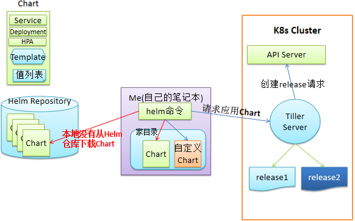

# 介绍
kubernetes包管理工具，类似于CentOS的yum，Ubuntu的apt包管理工具，快速安装部署或升级软件。

# Helm官方地址
https://helm.sh

# 环境准备
- Linux服务器
- kubernetes集群（采用Minikube部署）
- Helm二进制客户端

# 传统服务部署到k8s流程
拉取代码 $\Rightarrow$ 打包编译 $\Rightarrow$ 构建镜像 $\Rightarrow$ 准备k8s manifest资源清单 $\Rightarrow$  部署上线（kubectl apply -f deployment.yaml -f service.yaml）

# helm组件构成
- Helm客户端: helm的客户端组件，使用go语言编写，编译后只有一个可执行的二进制文件，负责和k8s集群通信
- Chart: Helm整合成以.tgz结尾的压缩包，里面包含了一整套k8s声明模板，类似于rpm或者deb或者dpkg包
- Repository：Chart包远程仓库，用于存储Chart包,类似于docker或yum仓库
- Release: Chart的实例，运行的服务


# Helm架构
## Helm2架构


## Helm3架构
Helm3版本去掉了Tiller Server，Helm客户端直接和K8s集群通信

# 安装Helm客户端
```shell
$ curl -fsSL -o get_helm.sh https://raw.githubusercontent.com/helm/helm/main/scripts/get-helm-3
$ chmod 700 get_helm.sh
$ ./get_helm.sh
$ helm version
version.BuildInfo{Version:"v3.3.0-rc.2", GitCommit:"8a4aeec08d67a7b84472007529e8097ec3742105", GitTreeState:"dirty", GoVersion:"go1.14.6"}
```

# helm目录结构
```shell
$ helm create hello_world
$ tree hello_world/
hello_world/                    # chart包名称
├── charts                      # 存放子chart的目录，目录里存放这个chat依赖的所有子chart
├── Chart.yaml                  # 保存chart的基本信息，包括名字、描述信息及版本等，这个变量文件都可以被templates目录下文件所引用                       # 
├── templates                   # 模板文件目录，目录里面存放所有yaml模板文件，包含了所有部署应用的yaml文件
│   ├── deployment.yaml         # 创建deployment对象的模板文件
│   ├── _helpers.tpl            # 放置模板助手的文件，可以在整个chat中重复使用，是放一些templates目录下这些yaml都有可能会用的一些模板
│   ├── hpa.yaml
│   ├── ingress.yaml
│   ├── NOTES.txt               # 存放提示信息的文件,介绍chat帮助信息,helm install部署后展示给用户,如何使用chat等,是部署chat后给用户的提示信息
│   ├── serviceaccount.yaml      
│   ├── service.yaml
│   └── tests                   # 用于测试的文件，测试完部署完chat后，如web，做一个链接，看看你是否部署正常
│       └── test-connection.yaml
└── values.yaml                 # 用于渲染模板的文件(变量文件，定义变量的值) 定义templates目录下的yam文件可能引用到的变量
                                # values.vaml用于存储 templates 目录中模板文件中用到变量的值，这些变量定义都是为了让templates目录下yaml引用
```


# 编写一个简单的chart
## 创建helm chart
```shell
# helm create mychart

删除不需要的文件
# rm -rf mychart/templates/*

# tree mychart
mychart/
├── charts
├── Chart.yaml
├── templates
└── values.yaml
```
## 编写configmap.yaml
```shell
# cd mychart/templates
# vim configmap.yaml
apiVersion: v1
kind: ConfigMap
metadata:
  name: mychart-configmap
data:
  myvalue: "hello world!"
```

## 创建Release实例
```shell
# cd ../../
# helm install configmap_demo ./mychart
NAME: configmap-demo
LAST DEPLOYED: Sun Jul 23 15:26:50 2023
NAMESPACE: default
STATUS: deployed
REVISION: 1
TEST SUITE: None

查看Release实例
# helm ls
NAME          	NAMESPACE	REVISION	UPDATED                                	STATUS  	CHART        	APP VERSION
configmap-demo	default  	1       	2023-07-23 15:26:50.524896697 +0800 CST	deployed	mychart-0.1.0	1.16.0     

# helm get manifest configmap-demo
---
# Source: mychart/templates/configmap.yaml
apiVersion: v1
kind: ConfigMap
metadata:
  name: mychart-configmap
data:
  myvalue: "hello world!"
```

## 删除Release实例
```shell
# helm uninstall configmap-demo
release "configmap-demo" uninstalled
```

# 创建变量的configmap
```shell
# cat mychart/values.yaml 
MY_KEY: "hello,world!"

# cat mychart/templates/configmap.yaml 
apiVersion: v1
kind: ConfigMap
metadata:
  name: {{ .Release.Name  }}-configmap
data:
  myvalue: {{ .Values.MY_KEY  }}
```

## 安装变量configmap
```shell
# helm install mychartconfigmap2 mychart/
NAME: mychartconfigmap2
LAST DEPLOYED: Sun Jul 23 19:36:34 2023
NAMESPACE: default
STATUS: deployed
REVISION: 1
TEST SUITE: None

# helm ls
NAME             	NAMESPACE	REVISION	UPDATED                                	STATUS  	CHART        	APP VERSION
mychartconfigmap2	default  	1       	2023-07-23 19:36:34.481242549 +0800 CST	deployed	mychart-0.1.0	1.16.0

# helm get manifest mychartconfigmap2 
---
# Source: mychart/templates/configmap.yaml
apiVersion: v1
kind: ConfigMap
metadata:
  name: mychartconfigmap2-configmap
data:
  myvalue: hello,world!
```

## 删除实例
```shell
# helm uninstall mychartconfigmap2 
release "mychartconfigmap2" uninstalled
```

## 模拟运行 --dry-run
```shell
# helm install test mychart/ --debug --dry-run
install.go:172: [debug] Original chart version: ""
install.go:189: [debug] CHART PATH: /root/helm/mychart

NAME: test
LAST DEPLOYED: Sun Jul 23 19:42:44 2023
NAMESPACE: default
STATUS: pending-install
REVISION: 1
TEST SUITE: None
USER-SUPPLIED VALUES:
{}

COMPUTED VALUES:
MY_KEY: hello,world!

HOOKS:
MANIFEST:
---
# Source: mychart/templates/configmap.yaml
apiVersion: v1
kind: ConfigMap
metadata:
  name: test-configmap
data:
  myvalue: hello,world!
```


