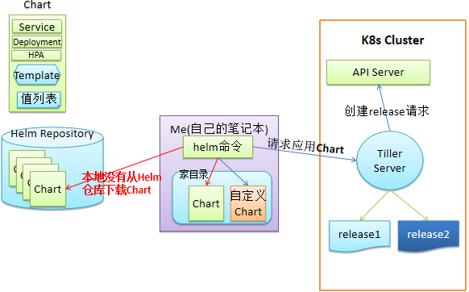

# 介绍
kubernetes包管理工具，类似于CentOS的yum，Ubuntu的apt包管理工具，快速安装部署或升级软件。

# Helm官方地址
https://helm.sh

# 环境准备
- Linux服务器
- kubernetes集群（采用Minikube部署）
- Helm二进制客户端

# 传统服务部署到k8s流程
拉取代码 $\Rightarrow$ 打包编译 $\Rightarrow$ 构建镜像 $\Rightarrow$ 准备k8s manifest资源清单 $\Rightarrow$  部署上线（kubectl apply -f deployment.yaml -f service.yaml）

# helm组件构成
- Helm客户端: helm的客户端组件，使用go语言编写，编译后只有一个可执行的二进制文件，负责和k8s集群通信
- Chart: Helm整合成以.tgz结尾的压缩包，里面包含了一整套k8s声明模板，类似于rpm或者deb或者dpkg包
- Repository：Chart包远程仓库，用于存储Chart包,类似于docker或yum仓库
- Release: Chart的实例，运行的服务

# helm目录结构
```shell
[root@ecs-344692 helm]# tree hello_world/
hello_world/
├── charts
├── Chart.yaml
├── templates
│   ├── deployment.yaml
│   ├── _helpers.tpl
│   ├── hpa.yaml
│   ├── ingress.yaml
│   ├── NOTES.txt
│   ├── serviceaccount.yaml
│   ├── service.yaml
│   └── tests
│       └── test-connection.yaml
└── values.yaml
```
# Helm架构
## Helm2架构


## Helm3架构
Helm3版本去掉了Tiller Server，Helm客户端直接和K8s集群通信